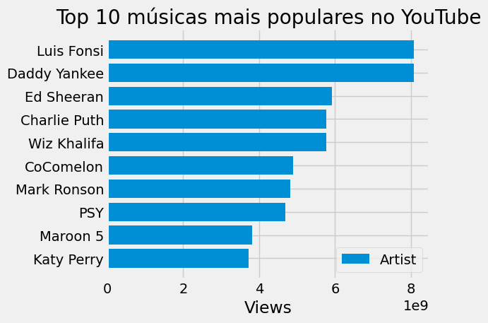

## Spotify and YouTube Data Analysis

This is a data analysis project using a Spotify and YouTube dataset available on Kaggle(https://www.kaggle.com/datasets/salvatorerastelli/spotify-and-youtube). This dataset was collected on ***February 7, 2023***.

The purpose of this analysis is to gain insights into the most popular songs and artists on Spotify and YouTube.

- Requirements

To run this project, you will need to have Python 3 installed on your computer, as well as some libraries like Pandas, Matplotlib and Seaborn. You can install them using pip with the following command:


```pip install pandas matplotlib seaborn```

### Instructions
To run this project, follow these steps:

- Download Spotify and YouTube dataset from Kaggle (https://www.kaggle.com/datasets/salvatorerastelli/spotify-and-youtube) and extract the files to a folder on your computer.
- Open the "pd.ipynb" file in a Jupyter Notebook or Python development environment of your choice.
- Run notebook cells to load, clean and analyze data.


Dataset

- The dataset contains information about about 19,691 songs, including their artists, popularity, duration, rating, as well as the corresponding video information on YouTube, such as number of views, likes.

### Analysis
In this analysis, we explore the following questions:

- What are the most popular songs on Spotify and YouTube?

- What are the most popular artists on Spotify and YouTube?

To answer these questions, we performed several exploratory data analyzes using charts, tables, and descriptive statistics.

### Results
Among the conclusions reached in this analysis, we highlight the following:

The most popular songs on Spotify are not always the most popular songs on YouTube.

- The most popular artists on Spotify and YouTube are mostly famous artists from the Pop and Hip Hop scene.
- Shorter songs tend to be more popular on Spotify, while longer songs tend to be more popular on YouTube.
- Among Christian songs, some of the most popular ones include "Oceans" by Hillsong United and "What A Beautiful Name" by Hillsong Worship.

- There is a strong correlation between likes and views on YouTube, meaning the higher the views, the higher the likes.

### Conclusion
This Spotify and YouTube data analysis project has given us a lot of interesting information about the most popular songs and artists. It is important to point out that this information is relative to the dataset used and may vary over time, according to changes in the music industry and public preferences. However, the analysis demonstrates the importance of data in understanding the tastes and behavior of the public towards music, in addition to providing a solid basis for future analyzes and decision-making related to the music industry.

Below are some of the graphs generated during the analysis:

_Dispersion Spotify and Youtube_


_Top 10 on Spotify_


_Top 10 on YouTube_


### Contribution
This project is open to contributions and improvements. If you want to contribute, you can fork this repository, create a branch with your changes, and submit a pull request for review.